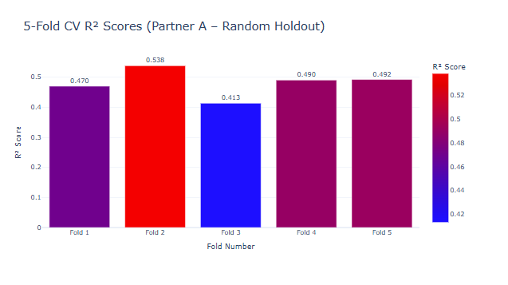
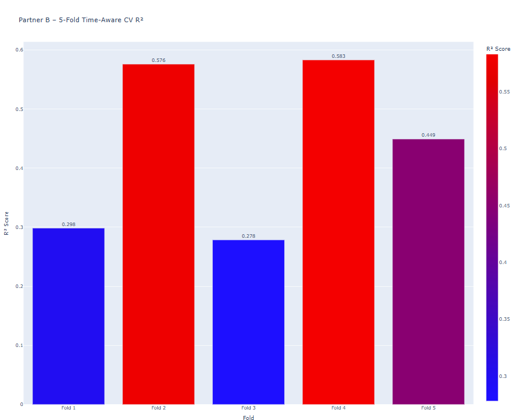
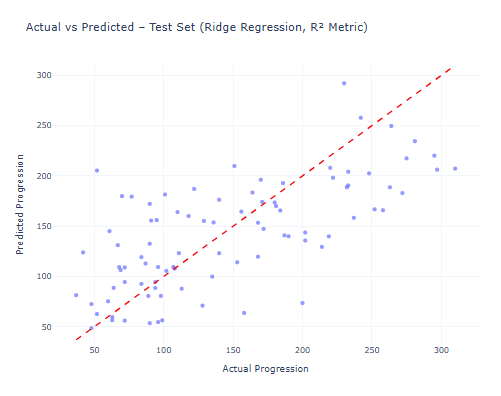
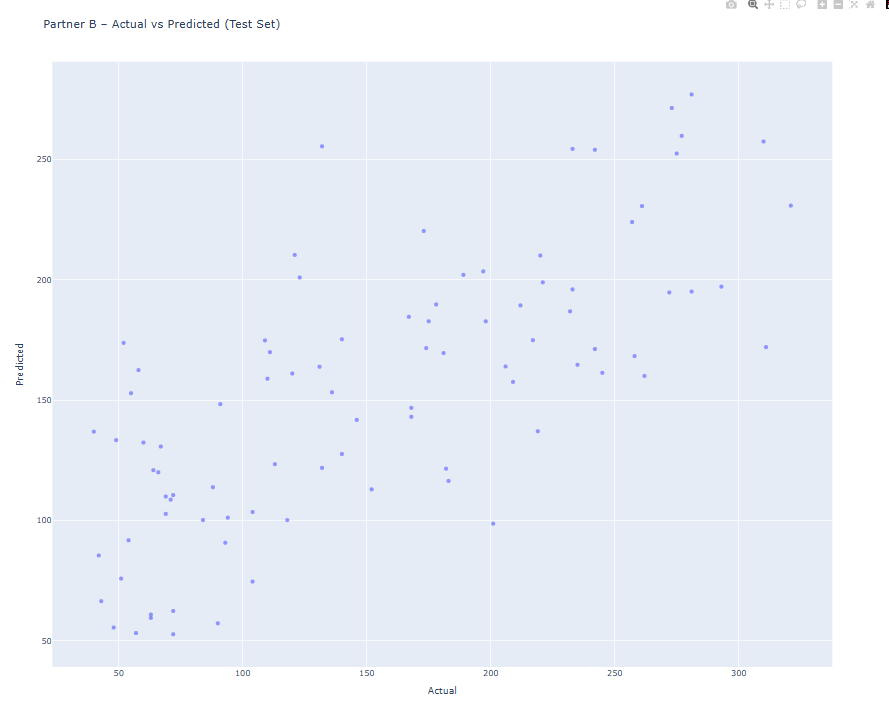
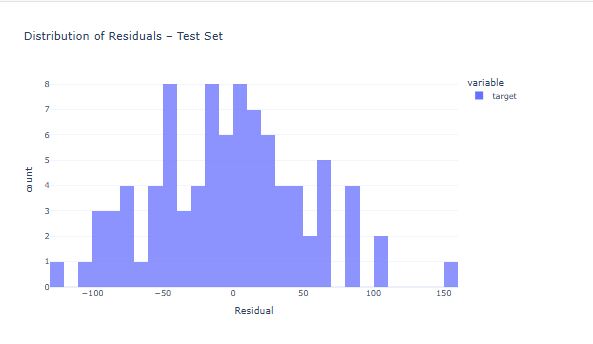
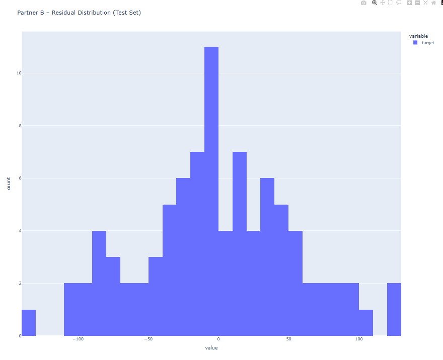

# Week 9 – Split Strategy Showdown  
## Partner Comparison: Random Holdout vs Time-Aware Split  

This document summarizes and compares the evaluation strategies for:

- **Partner A – Andrea Churchwell**  
  - Random 80/20 holdout  
  - 5-fold KFold cross-validation  

- **Partner B – Jose Diaz**  
  - Ordered 80/20 holdout (first 80% → train, last 20% → test)  
  - 5-fold TimeSeriesSplit (time-aware CV)  

The goal is to:

1. Describe the dataset and model setup.  
2. Summarize Partner A and Partner B results.  
3. Compare cross-validation stability and residual errors.  
4. Explain which strategy is more appropriate for the diabetes dataset and why.  

---

### 🔍 Executive Summary
- Partner A's Random Holdout + KFold produced more stable and higher average R² scores.
- Partner B's TimeSeriesSplit had much higher variance due to the dataset not being temporal.
- Visuals confirm that Partner A’s model generalizes more consistently (residuals, scatterplots, CV).
- Recommendation: Use Partner A’s approach for this dataset; Partner B’s approach fits true time series.

## 1. Dataset Overview  

- **Name:** Diabetes Regression (`sklearn.datasets.load_diabetes`)  
- **Samples:** 442 patients  
- **Features:** 10 numeric health measurements (age, BMI, blood pressure, etc.)  
- **Task Type:** Regression – predict a continuous disease progression score  
- **Metric:** R²  

This is a **small, noisy medical dataset**, which means:

- Different train/test splits can give noticeably different scores.  
- R² values around **0.45–0.55** are normal.  
- Stability (variance across splits) is just as important as the raw R² number.  

---

## 2. Partner A – Random Holdout + KFold (Andrea)  

### Strategy  

- **80/20 random train/test split** using `train_test_split(..., shuffle=True, random_state=42)`.  
- **5-fold KFold** cross-validation on the training data.  
- Model: `StandardScaler` + `Ridge` regression combined in a `Pipeline`.  
- Metric: R².  

Using a `Pipeline` prevents data leakage because the scaler is fit **only on the training data** inside each split or fold.  

### Train/Test Performance  

- **Train R²:** 0.5276  
- **Test R²:** 0.4541  

Interpretation:  

- The model explains about **52–53%** of the variance on the training set.  
- It explains about **45%** of the variance on unseen test data.  
- The drop from train → test is **small and normal** for a small, noisy dataset.  
- This suggests the model is learning real patterns and generalizes reasonably well.  

### 5-Fold CV (KFold) Results  

Fold R² scores:

- Fold 1: 0.4699  
- Fold 2: 0.5381  
- Fold 3: 0.4133  
- Fold 4: 0.4903  
- Fold 5: 0.4922  

Summary:

- **Mean R²:** ~0.4808  
- **Std (variance):** ~0.04  

This shows **low-to-moderate variance**: the model behaves similarly across folds.  
For this dataset, Partner A’s strategy gives **stable** and **reliable** estimates.  

There is some wobble between folds (e.g., Fold 2 higher, Fold 3 lower), which is expected with only 442 samples.  

---

## 3. Partner B – Ordered Holdout + TimeSeriesSplit (Jose)  

### Strategy  

- **Ordered 80/20 split**:  
  - First 80% of rows → training set  
  - Last 20% of rows → test set  
- **5-fold TimeSeriesSplit** on the training data (no shuffling; later folds always validate on “later” rows).  
- Same model as Partner A: `StandardScaler` + `Ridge` in a `Pipeline`.  
- Metric: R².  

This simulates a **time-aware** evaluation: train on “earlier” data, validate on “later” data, even though the diabetes dataset is not truly time series.  

### Train/Test Performance  

- **Train R²:** 0.5088  
- **Test R²:** 0.5413  

Interpretation:  

- On this particular ordered split, the last 20% of the data (test set) is slightly **easier** than the earlier rows.  
- That’s why test R² ends up a bit higher than train R².  
- This is not an error; it can happen on small datasets with non-random splits.  

### 5-Fold TimeSeriesSplit Results  

Fold R² scores:

- Fold 1: 0.2984  
- Fold 2: 0.5760  
- Fold 3: 0.2785  
- Fold 4: 0.5831  
- Fold 5: 0.4492  

Summary:

- **Mean R²:** ~0.4373  
- **Std (variance):** ~0.13  

Compared to Partner A, Partner B’s strategy has:

- A **lower mean R²**, and  
- A **much higher variance** across folds.  

TimeSeriesSplit forces each fold to train on earlier rows and validate on later rows.  
For a dataset that is **not actually temporal**, this mostly increases instability instead of adding realism.  

---

## 4. Cross-Validation Summary  

From `comparison.csv` (combined Partner A + Partner B CV scores):  

| Strategy    | Mean R² | Std (variance) |
|------------|--------:|---------------:|
| Partner A  | ~0.48   | ~0.04          |
| Partner B  | ~0.44   | ~0.13          |

Key points:

- Partner A has a **higher average R²** and **much lower variance**.  
- Partner B has a **lower average R²** and **very bouncy scores** (from ~0.28 to ~0.58).  

This matches what you see in the CV bar charts:  

- `assets/partner_a_cvr2.png`  
- `assets/partner_b_cvr2.png`  

Open these two images side by side in VS Code to visually confirm the difference.  

---

## 5. Visual Comparisons
Below are our key visuals and interpretations for both strategies.

Below are the screenshots for both partners, embedded directly into the document.

## 5.1 Cross-Validation Bar Charts (Side-by-Side)
### What We’re Looking At (Cross-Validation)

- **Each bar = one fold of cross-validation** (5 total).
- Higher bars = better model performance.
- Differences in bar height = how “stable” the model is across different slices of data.

**Partner A (Random KFold):**
- Bars are grouped tightly together.
- Scores range from ~0.41 to ~0.54.
- Very small variance (std ≈ 0.04).
- This means **the model behaves consistently** no matter how the data is split.

**Partner B (TimeSeriesSplit):**
- Bars swing dramatically between folds.
- Scores range from ~0.27 to ~0.58.
- Very large variance (std ≈ 0.13).
- This means the model is **unstable** under the time-aware split (because the dataset is NOT temporal).

**Interpretation:**
- Partner A’s strategy is more reliable and predictable.
- Partner B’s strategy introduces unnecessary instability for this dataset.
<table>
<tr>
<td>
<strong>Partner A – 5-Fold CV R²</strong> 

</td>

<td>
<strong>Partner B – 5-Fold CV R²</strong> 

</td>
</tr>
</table>
**Summary:** Partner A’s folds show tight, consistent performance, while Partner B’s folds swing dramatically, proving that KFold gives much more stable estimates for this dataset.

---
## 5.2 Actual vs Predicted
### What We’re Looking At (Actual vs Predicted)

These scatterplots show:
- **X-axis = actual disease progression**
- **Y-axis = model’s predicted score**

A perfect model would have all points lying exactly on a diagonal “match” line.

**Partner A:**
- Upward trend is more visible.
- Points cluster more tightly around the dashed trendline.
- This indicates the model is capturing the linear relationship reasonably well.
- Still some noise — expected for this small dataset.

**Partner B:**
- The upward trend is still there but the spread of points is wider.
- Without the trendline, it's clear the relationship is noisier.
- This reflects the higher variance observed in cross-validation.

**Interpretation:**
- Both models learn the general pattern.
- Partner A has slightly better alignment with actual values.
- Partner B displays more scatter (less consistent predictions).

<table>
<tr>
<td>
<strong>Partner A – Actual vs Predicted</strong> 

</td>

<td>
<strong>Partner B – Actual vs Predicted</strong> 

</td>
</tr>
</table>
**Summary:** Both partners capture the general trend, but Partner A’s predictions align more closely with actual values, showing a cleaner and more reliable linear relationship.

---

## 5.3 Residual Histograms
### What We’re Looking At (Residuals)

Residual = (Predicted − Actual).  
A good model has residuals clustered around **0**, meaning predictions are close to reality.

**Partner A:**
- Residuals are more tightly centered.
- Histogram shape is smoother.
- Fewer extreme errors.
- This matches the lower variance from the CV results.

**Partner B:**
- Residuals are more spread out.
- More extreme prediction errors.
- This reflects instability caused by the time-aware split.

**Interpretation:**
- Partner A’s model makes more consistent errors.
- Partner B’s model has wider, less predictable error patterns.
- Again, this supports the conclusion that KFold is the more appropriate strategy.

<table>
<tr>
<td>
<strong>Partner A – Residual Histogram</strong> 

</td>

<td>
<strong>Partner B – Residual Histogram</strong> 

</td>
</tr>
</table>
**Summary:** Partner A’s residuals cluster tightly around zero, while Partner B’s are more spread out, confirming that the time-aware split introduces greater prediction error.

---

## 6. Recommendation  

Both partners correctly implemented their assigned strategies:

- Partner A: random 80/20 split + 5-fold KFold CV.  
- Partner B: ordered 80/20 split + 5-fold TimeSeriesSplit (time-aware CV).  

However, the **diabetes dataset is not temporal** — the row order does not represent time.

Because of that:

- Randomized KFold (Partner A) is **better suited** to this dataset.  
- It produces **higher mean R²** and **much more stable** results.  
- TimeSeriesSplit (Partner B) mainly increases variance without adding realism here.  

**Final conclusion:**  

> For the Diabetes Regression dataset, I recommend Partner A’s random holdout + KFold strategy as the primary evaluation method. Partner B’s ordered + time-aware approach is still valuable to understand and would be more appropriate for a true time series problem (e.g., forecasting over months or years), but it is less well-matched to this specific dataset.
